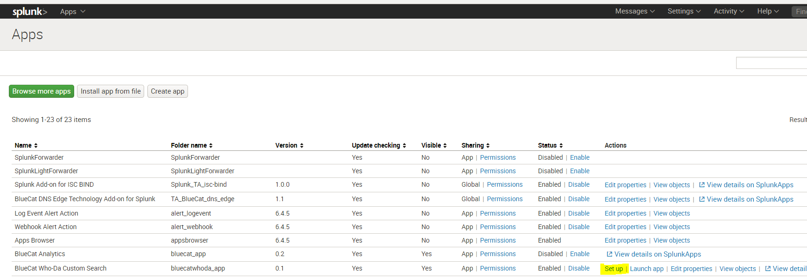
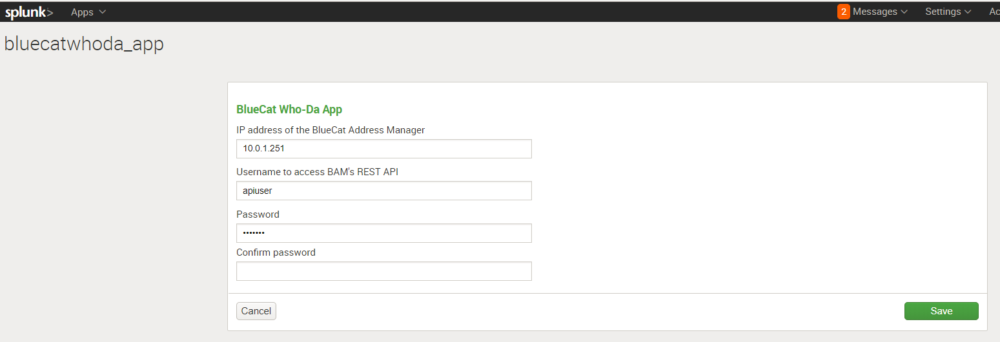
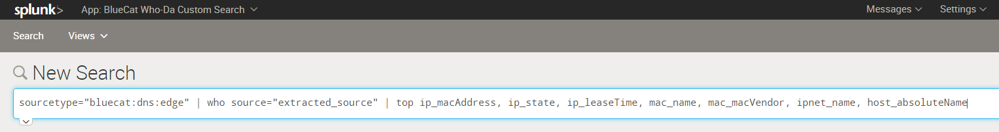
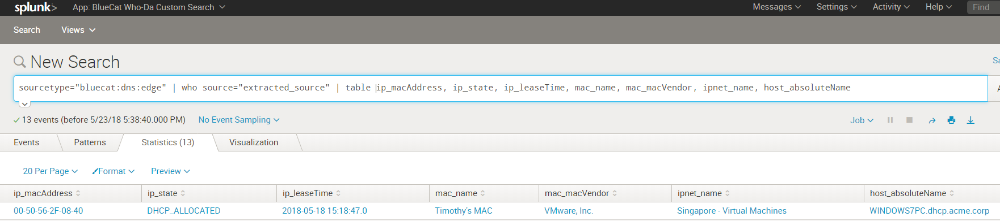

# Who-Da add-on for Splunk

The Who-Da add-on for Splunk is a customized search function that can be used in co-ordination with your search indexes to provide complete visibility of information behind an IP address.

Customers using BlueCat DNS Integrity can use this add-on to find the following information for any IP address:
- Associated MAC Address
- The Network where this IP address resides
- MAC address name
- Mac Vendor type
- Hostname if this IP has a DNS entry
- IP Address type (DHCP or Static)
- IP Address lease time (if DHCP)

## Installation Instructions

To install the app directly from this repository:

1. Copy the who-da directory to `$SPLUNK_HOME/etc/apps/who-da`
2. Restart Splunk

To package this app for easy installation on another server:
1. Package the application with the command: `splunk package who-da`
2. The package file `who-da.spl` will be created in the directory `$SPLUNK_HOME/etc/system/static/app-packages/`

To install from the package file:

1. Login to Splunk with an Administrator account
2. Clicks the "Apps" dropdown in the upper left corner of the screen and select "Manage Apps"
3. Select "Install App from file"
4. Click "Choose file", navigate to the app package created above, and click "Upload"

## Configuration Instructions

After successfully installing the app, the app should be visible under the Splunk Apps section as shown below.

Click on "Set up", listed under Actions for the Who-Da app:

Configure the credentials to use to connect to your BlueCat Address Manager on the setup page:
- Enter the IP address of your BlueCat Address Manager
- Enter the username to be used for the REST API
- Enter the password and confirm it again
- Click Save

## Using Who-Da custom search

Customers can use the “who” command by piping any data that has IP address information fields in it. The “who” command needs to be provided the name of the field that represents an IP address to be analysed as follows:

`< Any Splunk index | other commands | who source="field_of_interest">`

In the following example, 'dnsclient' is a field that represents an IP address performing a DNS query.

If the query was successful, you should see the IP Address details such as the MAC address, network, IP address type, lease time, etc appear in the results as shown below:

## Credits
The Who-Da add-on for Splunk has been designed and developed by the BlueCat JAPAC team. 

#### The Team:
- David Jones
- Michael Nonweiler
- Timothy Noel

## License

Copyright 2018 BlueCat Networks (USA) Inc. and its affiliates

Licensed under the Apache License, Version 2.0 (the "License");
you may not use this file except in compliance with the License.
You may obtain a copy of the License at

    http://www.apache.org/licenses/LICENSE-2.0

Unless required by applicable law or agreed to in writing, software
distributed under the License is distributed on an "AS IS" BASIS,
WITHOUT WARRANTIES OR CONDITIONS OF ANY KIND, either express or implied.
See the License for the specific language governing permissions and
limitations under the License.

